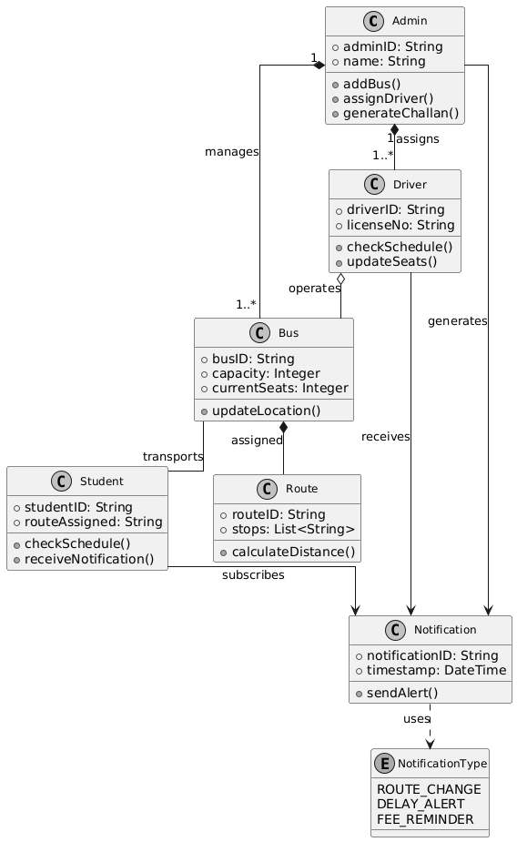
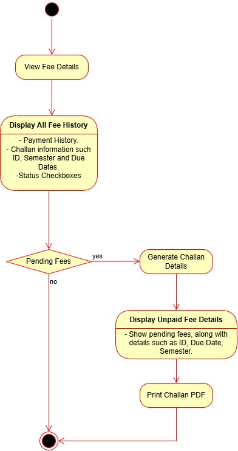
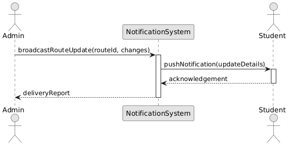
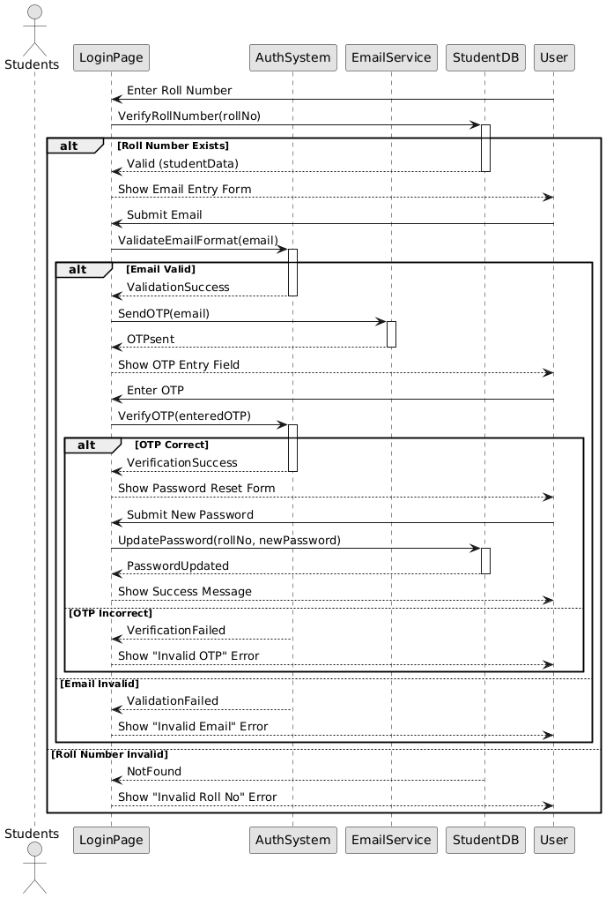
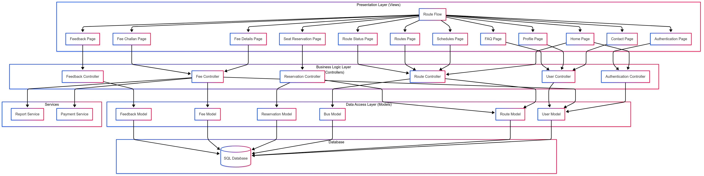
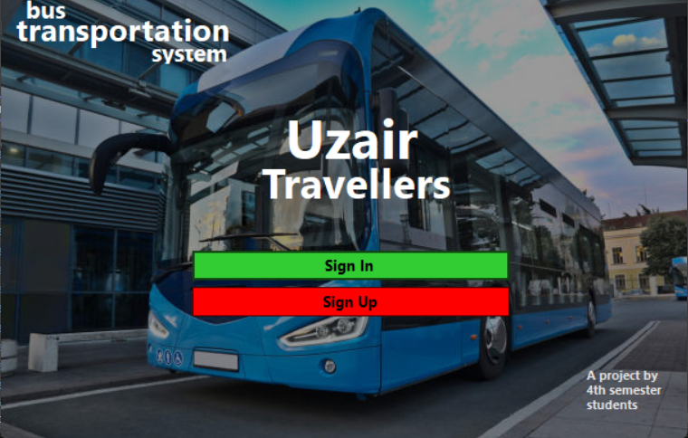
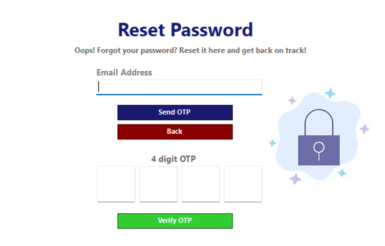
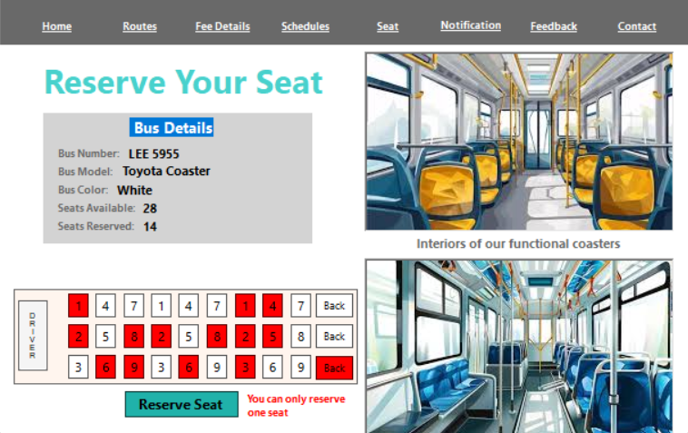
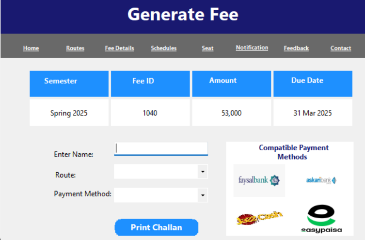
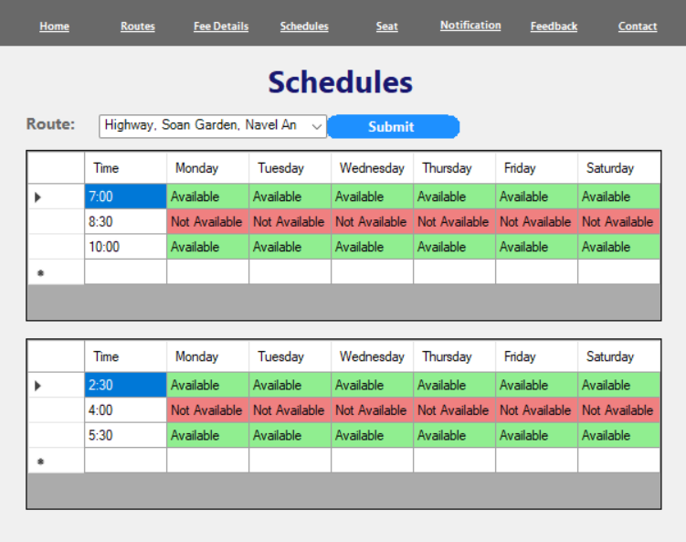

# 📍 RouteFlow: University Transport Management System

## 👥 Project Team

- **Saif Shahzad** (23i-2634)  
- **Haider Abbas** (23i-2558)  
- **Hamd Ul Haq** (23i-0081)  
**Department of Artificial Intelligence and Data Science**  
**National University of Computer and Emerging Sciences, Islamabad**

---

## 🙏 Acknowledgment

We sincerely thank **Ma’am Zonera** for her constant guidance and mentorship throughout the *Fundamentals of Software Engineering* course. Her encouragement and feedback were instrumental in the completion of this project.

---

## 📌 Project Overview

**RouteFlow** is a transport management system tailored for university students. It aims to solve issues like delays, miscommunication, and lack of real-time updates in public transportation.  
Key features include:

- Schedule change notifications  
- Online fee management  
- Seat reservation system  
- Feedback and FAQ sections  

---

## 🚦 Development Phases

### Sprint 1:
- Secure login/signup system  
- Basic dashboard and navigation  

### Sprint 2:
- Fee tracking and challan generation  
- Route updates, contact, FAQ, feedback pages  

### Sprint 3 (Planned):
- UI refinement, profile management  
- Seat reservation  
- Final debugging and deployment  

---

## 🧩 Key Features (User Stories Summary)

Each user story was implemented to improve usability and functionality:

- **User Authentication (Login/Signup)**
- **Password Reset**
- **Dashboard Overview**
- **Secure Logout**
- **Contact Information**
- **Feedback System**
- **Seat Reservation**
- **FAQ Access**
- **Fee Details and Challan Generation**
- **Profile Management**
- **Live Bus Status with Weather**
- **Route and Schedule Filtering**

---

## 🛠 Design Diagrams

- 
- 
- 
- 
- 
- 
- 
- 

---

## 🧱 Architecture

### MVC-Based Architecture:

- **Views (Presentation):** Windows Forms (Home, Login, Profile, etc.)  
- **Controllers (Logic):** Authentication, Route, Reservation, Fee, User, Feedback  
- **Models (Data):** Represent users, routes, buses, reservations, fees, and feedback  
- **Services:** Notification and Report generation  

---

## 📷 UI Snapshots

- 
- 
- 
- 
- 
- 
- 
- 
- 

---

## 📉 Product Burn Down Chart

---

## 🧾 Sprint Workflow via Scrum Board

- 
- 
- 

---

## ✅ Boundary Value Analysis

Implemented for:

- **Full Name** (2–255 chars)  
- **Roll Number** (format: iXXXXXX)  
- **Password** (4–8 alphanumeric + special characters)  

---

## 👨‍💻 Team Work Division

| Team Member    | Responsibilities |
|----------------|------------------|
| **Haider Abbas** | UI fixes, documentation, presentation |
| **Hamd-Ul-Haq** | Schedules Page, Scrum Board, linking UI, burndown chart |
| **Saif Shahzad** | Backend logic, boundary analysis, LaTeX docs |

---

## 💡 Lessons Learned

- Importance of **planning** and structured development  
- Need for **adaptability** and proactive **problem-solving**  
- Emphasis on **user-centric** design for smooth interactions  
- Value of **team collaboration** and effective communication  
- Role of **thorough testing and debugging**  
- Continuous learning throughout development  

